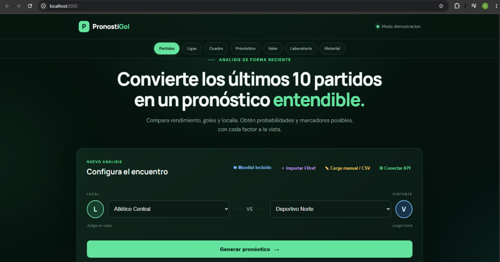
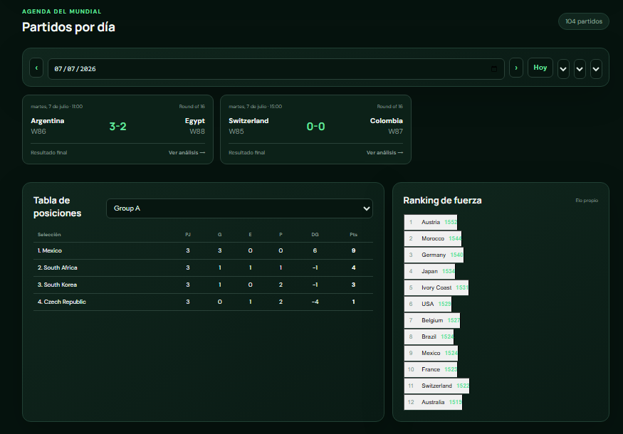
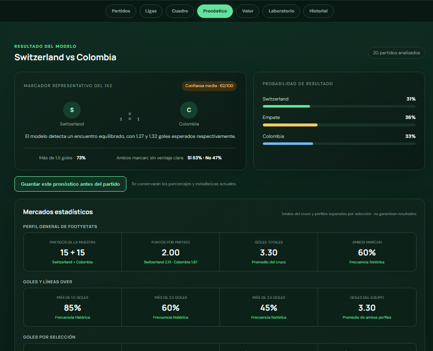
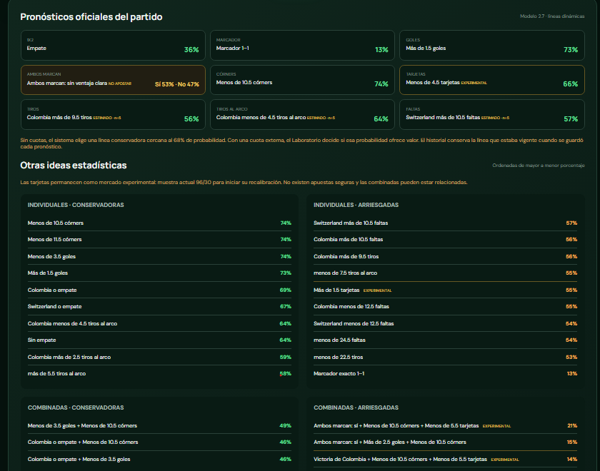
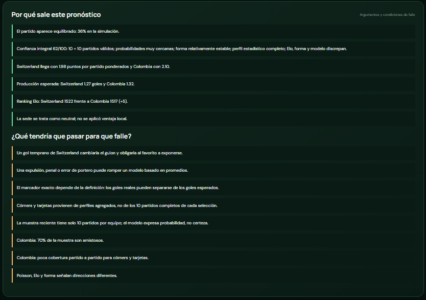
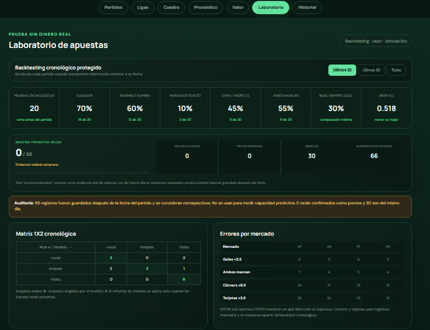
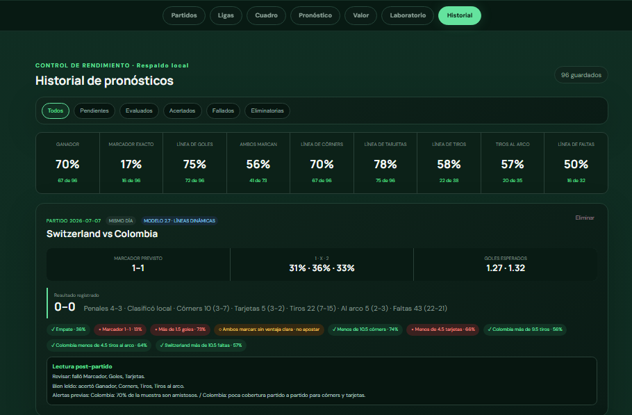
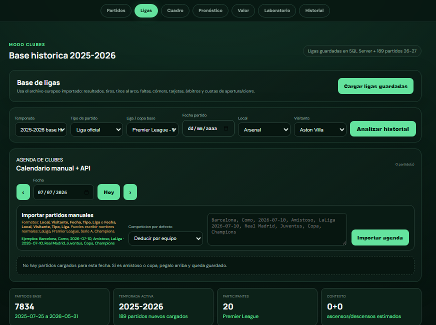

# PronostiGol

PronostiGol es una aplicación web local para analizar partidos de fútbol y generar pronósticos estadísticos a partir de datos históricos, perfiles de equipos, calendario, resultados y simulaciones de apuestas ficticias.

El proyecto nació enfocado en selecciones y Mundial 2026, pero también incluye una base para trabajar con ligas de clubes mediante datos históricos y sincronización con football-data.org.

> Importante: PronostiGol es una herramienta de análisis y simulación. No garantiza resultados deportivos ni realiza apuestas reales.

## Qué hace

- Genera pronósticos 1X2, marcador probable, goles esperados, ambos marcan, córners, tarjetas, tiros y faltas.
- Usa forma reciente, goles a favor/en contra, localía, Elo, recencia, tipo de competición y contexto del partido.
- Conserva un historial de pronósticos para comparar contra resultados reales.
- Calcula rendimiento por mercado: ganador, marcador, goles, BTTS, córners, tarjetas y otros mercados estadísticos.
- Incluye laboratorio de apuestas ficticias con saldo virtual, ROI, CLV, cuota justa, edge y control de exposición.
- Permite trabajar con calendario del Mundial, cuadro eliminatorio, grupos, partidos por día y resultados guardados.
- Integra datos locales en JSON y respaldo opcional en SQL Server.
- Incluye sincronización de ligas con football-data.org cuando se configura una API key.

## Tecnologías usadas

- HTML, CSS y JavaScript vanilla para la interfaz.
- Python para servidor local y sincronización de datos.
- PowerShell para importaciones y configuración de SQL Server.
- SQL Server Express opcional para persistencia.
- JSON como respaldo local de datos, calendarios y perfiles.
- Git/GitHub para control de versiones.

## Capturas

### Inicio y configuración



### Calendario, grupos y cuadro



### Pronóstico del partido



### Mercados estadísticos



### Explicación del modelo



### Laboratorio de apuestas ficticias



### Historial y evaluación



### Módulo de ligas



## Estructura principal

```text
PronostiGol/
├─ index.html                 # Interfaz principal
├─ app.js                     # Motor principal de pronósticos e historial
├─ tournament.js              # Mundial, calendario y cuadro
├─ leagues.js                 # Ligas, temporadas y partidos de clubes
├─ lab.js                     # Laboratorio de apuestas ficticias
├─ server.py                  # Servidor local
├─ sync_leagues.py            # Sincronización con football-data.org
├─ data/                      # Datos demo/históricos versionados
├─ config/                    # Plantilla de configuración, sin claves reales
├─ work/                      # Scripts auxiliares de importación
└─ docs/                      # Material de portafolio y documentación
```

## Cómo ejecutarlo

En Windows:

1. Descarga o clona el proyecto.
2. Abre la carpeta del proyecto.
3. Ejecuta `INICIAR_PRONOSTIGOL.bat`.
4. Mantén abierta la ventana de consola.
5. Entra a `http://localhost:8000`.

También puedes ejecutarlo manualmente:

```powershell
python server.py
```

Y luego abrir:

```text
http://localhost:8000
```

No se recomienda abrir `index.html` directamente, porque algunas funciones necesitan el servidor local.

## Configurar API de football-data.org

La API key real no se sube al repositorio.

Para sincronizar ligas:

1. Copia `config/football-data.key.example`.
2. Renombra la copia a `config/football-data.key`.
3. Pega tu API key dentro del archivo.
4. Ejecuta `SINCRONIZAR_LIGAS.bat`.

También puedes usar variable de entorno:

```powershell
$env:FOOTBALL_DATA_API_KEY="tu_clave"
python sync_leagues.py
```

## SQL Server opcional

PronostiGol puede funcionar solo con archivos locales, pero también permite guardar información en SQL Server Express.

Para configurarlo:

```text
CONFIGURAR_BASE_DATOS.bat
```

La documentación técnica de tablas e importación está en:

```text
DATABASE.md
```

## Datos y privacidad

Este repositorio no incluye:

- API keys reales.
- Historial local privado del usuario.
- Simulaciones personales guardadas localmente.
- Archivos temporales o cachés.

El archivo `.gitignore` excluye:

```text
config/football-data.key
data/*.local.json
tmp/
outputs/
__pycache__/
```

## Estado del proyecto

PronostiGol es un proyecto en evolución. Actualmente funciona como aplicación local de análisis, historial y simulación. Las siguientes mejoras naturales serían:

- Separar una versión demo pública con capturas.
- Mejorar diseño responsive.
- Crear panel de administración de datos.
- Agregar más fuentes de estadísticas.
- Automatizar resultados y fixtures cuando la API lo permita.
- Crear una API propia para consumir los pronósticos desde una app o bot.

## Uso responsable

Los pronósticos son estimaciones estadísticas. El fútbol tiene alta varianza y ningún modelo elimina el riesgo. El laboratorio de apuestas de PronostiGol usa dinero ficticio y está pensado para aprendizaje, backtesting y evaluación del modelo.
